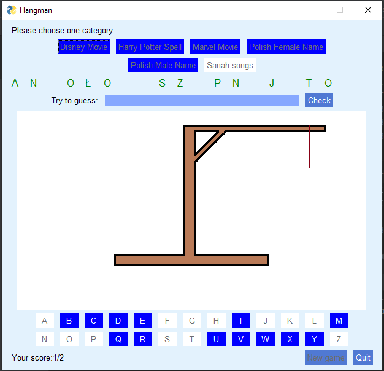

# Hangman
> An implementation of a popular hangman game. This was made with python and PySimpleGUI.

## Table of Contents
* [General Info](#general-information)
* [Technologies Used](#technologies-used)
* [Screenshots](#screenshots)
* [Setup](#setup)
* [Project Status](#project-status)
* [Sources](#sources)

## General Information
It is based on a popular hangman game. You have to guess a word (or short phrase) by picking the correct letters. Every wrong guess brings you closer to hanging a man and your loss. You can choose a category e.g. female name, Sanah songs or Harry Potter spells!

## Technologies Used
- Python 3.9
- Pandas
- PySimpleGUI

## Screenshots

## Setup
To run this project, download entire repository. You can also insert your CSV files with words or phrases to the directory 'csv_files' (words have to be stored in column "Name")

## Project Status
Project is in progress.
To do:
- insert measurement of time (for every guessing word)
- data analysis - selected categories, guessed words (in Matplotlib)

## Sources
CSV files were downloaded from:
- www.kaggle.com
- www.dane.gov.pl
